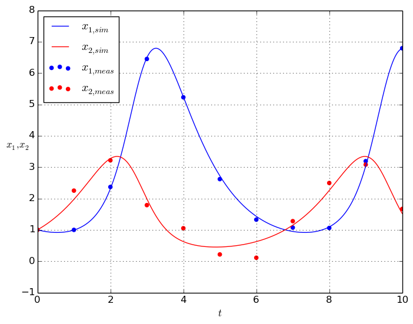
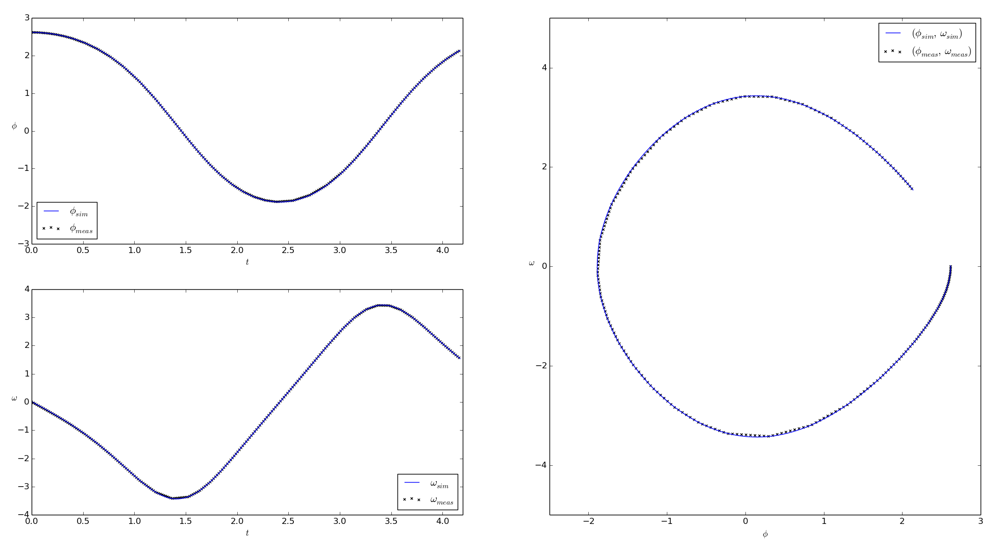
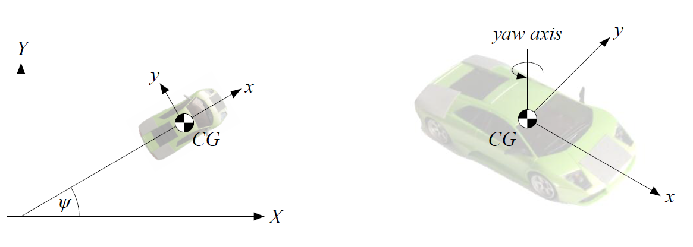

.. _examples:

Example applications
====================

The following example applications give hands-on impressions on how to use PEcas in practice. They all (and some more) are contained within the `examples directory <https://github.com/adbuerger/PECas/tree/master/examples>`_ of the PECas sources.

Parameter estimation for a Lotka-Volterra predator-prey-model
-------------------------------------------------------------

Model and data for this example application was taken from: *Bock, Sager et al.: Übungen zur Numerischen Mathematik II, sheet 9, IWR, Heidelberg university, 2006* (in German). The original resource can be found `here <http://www.iwr.uni-heidelberg.de/~agbock/TEACHING/2006ws/NUM2/UEBUNGSBLAETTER/THEORIE/t09.pdf>`_.

The aim of the application ``lotka_volterra.py`` is to estimate the unknown parameters of a Lotka-Volterra predator-prey-model for experimentally received measurement data and given standard deviations for the measurements. The predator-prey-model is an ODE of the form :math:`\dot{x} = f(x,p)`, given by

.. math::

    \begin{aligned}
        \dot{x}_1 &= - \alpha x_1 + \beta x_1 x_2 \\
        \dot{x}_2 &= \gamma x_2 - \delta x_1 x_2 \\
    \end{aligned}

where :math:`\alpha = 1.0` and :math:`\gamma = 1.0`, the states :math:`x` and parameters :math:`p` are defined as 

.. math::

    x = \begin{pmatrix} {x_1} \\ {x_2} \end{pmatrix}, ~ p = \begin{pmatrix} {\beta} \\ {\delta} \end{pmatrix},

and we can measure the full state, i. e.  

.. math::

    \phi = x.

The values resulting from the parameter estimation are 

.. math::

    \hat{p} = \begin{pmatrix} {\hat{\beta}} \\ {\hat{\delta}} \end{pmatrix} = \begin{pmatrix} {0.693379029} \\ {0.341128482} \end{pmatrix}.

The results for the system simulation using the estimated parameters in comparison the measurement data are shown in the figure below.

    Figure: Simulation results for the Lotka-Volterra predator-prey-model using the estimated parameters, compared to the given measurement data

Parameter estimation for a pendulum model
-----------------------------------------

Model and data for this example application was taken from: *Diehl, Moritz: Course on System Identification, exercise 7, SYSCOP, IMTEK, University of Freiburg, 2014/2015*. The original resource can be found `here <https://www.imtek.de/professuren/systemtheorie/events/dateien/exercise7.pdf>`_.

The aim of the application ``pendulum.py`` is to estimate the spring constant :math:`k` of a pendulum model for experimentally received measurement data. The pendulum model is an ODE of the form :math:`\dot{x} = f(x,u,p)`, given by

.. math::

    \begin{aligned}
        \dot{\nu} &= \omega \\
        \dot{\omega} &= \frac{k}{m L^2} (\psi - \nu) - \frac{g}{L} * \sin(\nu)  \\
    \end{aligned}

where :math:`m = 1.0`, :math:`L = 3.0` and :math:`g = 9.81`, the states :math:`x`, controls :math:`u` and parameters :math:`p` are defined as

.. math::

    x = \begin{pmatrix} {\nu} \\ {\omega} \end{pmatrix}, ~ u = \begin{pmatrix} {\psi} \end{pmatrix}, ~ p = \begin{pmatrix} {k} \end{pmatrix},

while the only control :math:`\psi` is the initial actuation angle of the pendulum, and therefor stays constant over time. Also, we can measure the full state, i. e. 

.. math::

    \phi = x.

The value resulting from the parameter estimation is

.. math::

    \hat{p} = \begin{pmatrix} {\hat{k}}\end{pmatrix} = \begin{pmatrix} {2.99763513} \end{pmatrix}.

The results for the system simulation using the estimated parameter in comparison the measurement data are shown in the figures below.

    Figure: Simulation results for the pedulum model using the estimated parameters, compared to the given measurement data#

Parameter estimation for a model race car
-----------------------------------------

Model, images and data for this example application was taken from: *Verschueren, Robin: Design and implementation of a time-optimal controller for model race cars, Master's thesis, KU Leuven, 2014*.

The aim of the application ``2d_vehicle.py`` is to estimate the unknown parameters of a 2D race car model for experimentally received measurement data. The race car and the interpretation of the model states are shown in the figure below.

    Figure: Depiction of the race car showing the models states

The 2D model of the race car is an ODE of the form :math:`\dot{x} = f(x,u,p,w_e)`, given by

.. math::

    \begin{aligned}
        \dot{X} &= v \, cos(\psi + C_{1} \delta) + w_{e,1} \\
        \dot{Y} &= v \, sin(\psi + C_{1} \delta) + w_{e,2} \\
        \dot{\psi} &= v \, \delta \, C_{2} + w_{e,3} \\
        \dot{v} &= C_{m_{1}} \, D - C_{m_{2}} \, D \, v - C_{r_{2}} \, v^{2} - C_{r_{0}} - (v \, \delta)^{2} \, C_{2} \, C_{1} + w_{e,4},
    \end{aligned}

where the states :math:`x`, controls :math:`u` and parameters :math:`p` are defined as 

.. math::

    x = \begin{pmatrix} {X} \\ {Y} \\ {\psi} \\ {v} \end{pmatrix}, ~ u = \begin{pmatrix} {\delta} \\ D \end{pmatrix}, ~ p = \begin{pmatrix} {C_{1}} \\ {C_{2}} \\ {C_{m_{1}}}  \\ C_{m_{2}} \\ {C_{r_{2}}} \\ {C_{r_{0}}} \end{pmatrix},

:math:`w_e` contains the equation errors, and we can measure the full state, i. e.  

.. math::

    \phi = x.

*(Results will follow soon)*

